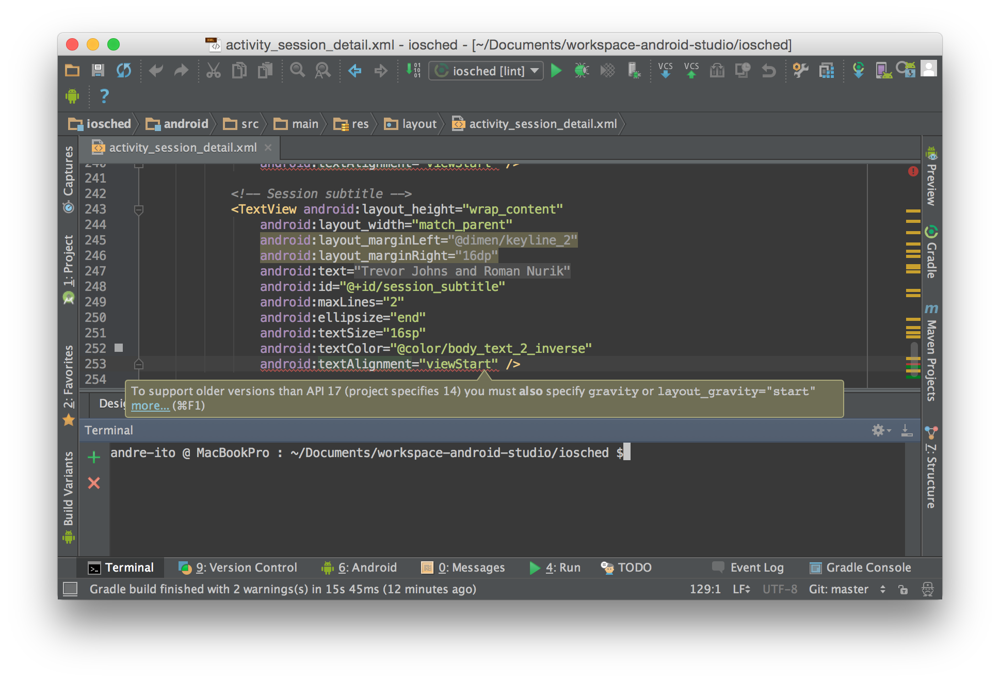
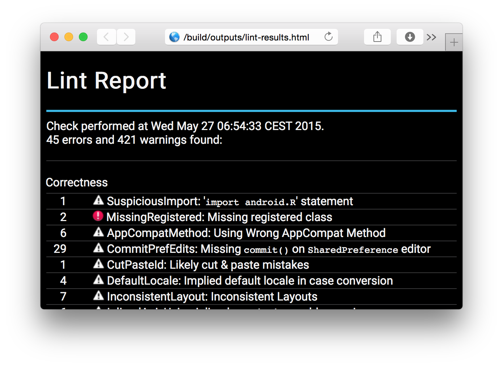

# 1. Introduction
Lint is a static code analysis tool which comes bundled with the Android SDK. It scans all kind of development artifacts of Android application projects and reports potential bugs, bad coding habits, broken conventions and much more. Lint is conveniently integrated into Android Studio but it also features a command line interface. By default Lint provides more than 200 built-in checks.

<br/>*Figure 1 - Lint workflow [1]*

## Usage

### Android Studio

Due to its default integration into Android Studio the usage of Lint is pretty convenient. Artifacts are scanned by default on every compile.

<br/>*Figure 2 - Android Studio Lint example*

### Command line
Besides its IDE integration Lint also features a command line interface. Its basic syntax is:

```shell
lint [flags] <project directory>
```

Please find an overview of available flags [here](http://developer.android.com/tools/help/lint.html) or feel free to call `lint --help`.

**Note:** There is also a default Gradle task which generates Lint reports for you: `./gradlew lint`

<br/>*Figure 3 - Lint example report*

## Configuration

Lint can be configured in different ways and at different levels (entire project, certain module/class/method/attribute, ...). In the following two options are presented:

### Gradle-based
When running Lint from Gradle or Android Studio configuration is done within the `build.gradle`. For example [1]:

```groovy
android {
    lintOptions {
       // set to true to turn off analysis progress reporting by lint
       quiet true
       // if true, stop the gradle build if errors are found
       abortOnError false
       // if true, only report errors
       ignoreWarnings true
       }
       ...
    }
```

A complete list of `lintOptions` is presented [here](http://tools.android.com/tech-docs/new-build-system/user-guide#TOC-Lint-support).

### File-based

Besides this and for command line usage Lint also features file-based configuration. Just place a file named `lint.xml` in the root directory of the Android project. Here is a short example [1]:

```xml
<?xml version="1.0" encoding="UTF-8"?>
<lint>
    <!-- Disable the given check in this project -->
    <issue id="IconMissingDensityFolder" severity="ignore" />

    <!-- Ignore the ObsoleteLayoutParam issue in the specified files -->
    <issue id="ObsoleteLayoutParam">
        <ignore path="res/layout/activation.xml" />
        <ignore path="res/layout-xlarge/activation.xml" />
    </issue>

    <!-- Ignore the UselessLeaf issue in the specified file -->
    <issue id="UselessLeaf">
        <ignore path="res/layout/main.xml" />
    </issue>

    <!-- Change the severity of hardcoded strings to "error" -->
    <issue id="HardcodedText" severity="error" />
</lint>
```

### Others
To be complete, there are even more configuration options available. To keep this guide short they are omitted here but you can read more about them [at this page](http://developer.android.com/tools/debugging/improving-w-lint.html#config).

## Further readings
- http://developer.android.com/tools/help/lint.html
- http://developer.android.com/tools/debugging/improving-w-lint.html

## References
1. http://developer.android.com/tools/debugging/improving-w-lint.html (visited 2015-06-08)

## License
&copy;2015 André Diermann

[](http://creativecommons.org/licenses/by-nc-sa/4.0/)

This work is licensed under a Creative Commons Attribution-NonCommercial-ShareAlike 4.0 International License.
