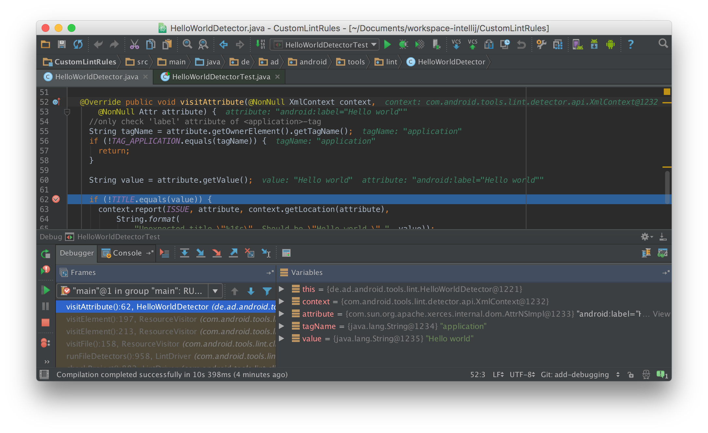
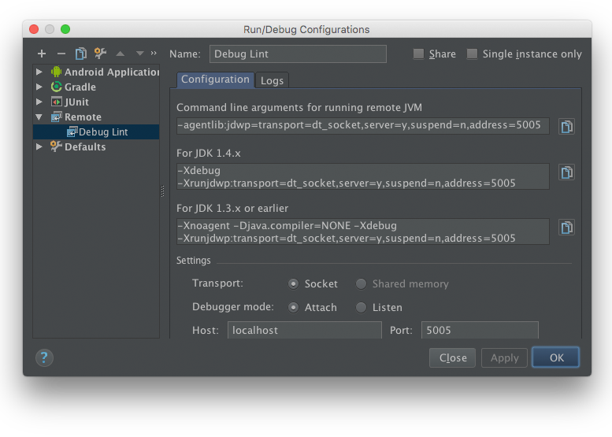

# 5. Verification
Testing and debugging are important activities in software development. This counts in particular for custom Lint rules, since they validate your code for convention flaws and other defects.

## 5.1 Testing
For a long time there exists no convenient way to test custom Lint rules. But fortunately Google released an [official library](https://bintray.com/android/android-tools/com.android.tools.lint.lint-tests/view) for testing custom Lint rules at end of May 2015. This version unfortunately had some [dependency issues](https://code.google.com/p/android/issues/detail?id=175161) which got fixed by version 24.3.0 at end of July 2015. **So please make sure to use this version or above.**

###Test library dependency
In order to use **lint-tests** library add the following lines to your `build.gradle`:

```groovy
repositories {
    ...
    maven {
        url  'https://dl.bintray.com/android/android-tools'
    }
}

dependencies {
    ...
    testCompile 'com.android.tools.lint:lint-tests:24.3.0'
}
```

**Note:** You need to add the Android tools repository `https://dl.bintray.com/android/android-tools` to the repository section of your `build.gradle`. Just `jcenter()` is not sufficient.

###Unit test
The following example demonstrate the basic test principles. It's taken from the CustomLintRule template project [1]:

```java
public class HelloWorldDetectorTest extends LintDetectorTest {

  //specify the Detector you want to test
  @Override protected Detector getDetector() {
    return new HelloWorldDetector();
  }

  //specify the Issues you want to test
  @Override protected List<Issue> getIssues() {
    return Arrays.asList(HelloWorldDetector.ISSUE);
  }

  //this needs to be overridden (see https://code.google.com/p/android/issues/detail?id=182195)
  @Override protected InputStream getTestResource(String relativePath, boolean expectExists) {
    String path = relativePath; //$NON-NLS-1$
    InputStream stream = this.getClass().getClassLoader().getResourceAsStream(path);
    if (!expectExists && stream == null) {
      return null;
    }
    return stream;
  }

  //assert that your custom Lint rule generates the expected output
  public void testShouldDetectNoWarning() throws Exception {
    assertEquals("No warnings.", lintFiles("ValidAndroidManifest.xml=>AndroidManifest.xml"));
  }
```

1. A test class needs to extend `LintDetectorTest`.
2. `getDetector()` needs to be overwritten and return the `Detector` which should be tested.
3. `getIssues()` is required to be overwritten and to return the `Issues` which should be tested.
4. Due to [an issue](https://code.google.com/p/android/issues/detail?id=182195) with the loading of test resources the `getTestResource()` method needs to be overwritten and use the actual `ClassLoader` to load the test resources.
5. An assertions is performed on the result of `lintFiles()` which takes a list of relative file names to test as argument and returns the resulting output as `String`.<br/>
*Note: By using an `=>` operator within the file `String` this file gets renamed when getting processed by Lint. This is useful for .java or .class files. You could store them with a .txt suffix for instance and rename them on the fly if you need to.*

More examples on how to test custom Lint rules can be found in [Android's Lint test source code](https://android.googlesource.com/platform/tools/base/+/master/lint/cli/src/test/java/com/android/tools/lint/checks/). The complete example from above is demonstrated in the CustomLintRule template project [1].

## 5.2 Debugging
The ability to test custom Lint rules significantly supports the creation of such rules. However, when performing those tests you will most probably find yourself in situations where your code does not what you expect it to do. That's where you want to debug your custom Lint rules and here is how it works.

### Debugging during testing
Debugging during testing fortunately works out of the box in both: *IntelliJ* and *Android Studio*.

Just set your breakpoints and perform your tests from within the IDE. Execution will halt at your breakpoints and you can start your debugging.



### Debugging during Gradle run

Debugging your custom Lint rules during testing is fine but sometimes there are still issues left when finally applying the custom Lint rules on real world code in your Android application projects.

It's even possible to debug your Custom rules during Gradle run. This requires some configuration effort [2]:

* Add to `gradle.properties`
```groovy
org.gradle.jvmargs=
    '-agentlib:jdwp=transport=dt_socket,server=y,suspend=n,address=5005'
```
* Start Gradle Daemon
```bash
./gradlew --daemon
```
* Add new remote debug configuration

* Run remote debug configuration


* Run Lint on your application project
```bash
./gradlew lint
```

## References
1. https://github.com/a11n/CustomLintRules
2. Credits for this approach go to Marc Prengemann. Thank you Marc for sharing! https://speakerdeck.com/winterdroid/better-code-through-lint-and-checkstyle?slide=58

## License
&copy;2015 André Diermann

[](http://creativecommons.org/licenses/by-nc-sa/4.0/)

This work is licensed under a Creative Commons Attribution-NonCommercial-ShareAlike 4.0 International License.
